# AI Powered Table Tennis Scoring System with Ball Launcher

## Paper Submission to ITAOI 2025

We have submitted our paper to [The 23rd Conference on Information Technology and Application in Outlying Islands (ITAOI 2025)](https://itaoi2025.gms.npu.edu.tw/).

You can view or download the full paper here:

👉 [Download AI-Scoring-System.pdf](./AI-Powered-Table-Tennis-Scoring-System-with-Ball-Launcher/AI-Scoring-System.pdf)

## Abstract

This paper proposes a **vision-based tracking system** for analyzing **table tennis ball trajectories** and **classifying landing points**, leveraging the capabilities of the **YOLOv7 object detection framework**.
The system initially detects and tracks the ball across consecutive video frames using YOLOv7.
Trajectories are constructed or updated by evaluating the **inter-frame distance**, **aspect ratio**, **intersection over union (IoU)**, and **motion direction** of the detected ball positions.

When a ball's motion deviates from the expected **parabolic trajectory**, a landing event is inferred.
To accurately determine the landing position on the table surface, the system applies a **perspective transformation** based on the four calibrated corners of the table.

Based on the identified landing location, each shot is categorized into one of the following classes: **valid hit**, **incorrect landing**, **out-of-bounds**, or **missed shot**.
By integrating YOLOv7, which offers both **high detection speed** and **precision**, the system significantly improves the **real-time performance** and **accuracy** of trajectory analysis.
Furthermore, the combination of **parabolic motion modeling** and **perspective correction** contributes to more **reliable landing point localization** and **robust shot classification**.

## Introduction

The rapid development of **computer vision** and **artificial intelligence (AI)** has led to widespread use of **object detection** and **tracking** technologies, especially in **sports analytics**.
These technologies help improve athlete performance, support strategy planning, and enable post-match analysis.
However, ensuring both **accuracy** and **real-time performance** in **high-speed sports** remains a significant challenge.

**Table tennis**, with its fast-moving ball and complex visual background, poses unique difficulties for traditional tracking algorithms.
Accurately detecting and tracking a **small, high-speed object** is essential for analyzing trajectories and landing points.

To address this, we adopt **YOLOv7** [1], a real-time object detection algorithm known for its **speed**, **accuracy**, and adaptability to fast-motion environments.
Combined with **trajectory analysis** and **perspective transformation**, our system can accurately classify landing results and provide detailed motion data.

This enables **automatic evaluation** of shots and supports training optimization, enhancing the functionality of **automated ball-serving machines**.

## Methodology

This study proposes a **YOLOv7-based detection and tracking framework** tailored for the fast-paced dynamics of table tennis.
The system addresses the challenge of **accurately tracking high-speed ball movement** by integrating real-time object detection with robust trajectory estimation.

At the core of the system is **YOLOv7**, a state-of-the-art object detection model known for its **high speed** and **accuracy**.
Leveraging its powerful feature extraction and classification capabilities, YOLOv7 enables reliable detection of the ball's presence and position, even under the complex visual conditions commonly encountered in table tennis matches.
Compared to traditional detection methods, YOLOv7 offers superior performance, ensuring **efficient and stable tracking**.

To manage object trajectories, the system incorporates a **trajectory management module** designed for **multi-object tracking scenarios**.
This mechanism precisely estimates and updates each trajectory, allowing the system to track multiple balls without confusion or target loss, even during rapid and overlapping movements.

An overview of the proposed method is illustrated in **Figure 1**. The process consists of the following stages:

1. **YOLOv7 architecture and detection pipeline** – for initial ball localization.
2. **Trajectory initialization and update** – based on inter-frame ball properties such as distance, direction, aspect ratio, and IoU.
3. **Landing point detection** – by identifying frames where the ball deviates from a parabolic path.
4. **Perspective transformation** – using reference corners to map the landing point onto the table surface.
5. **Shot classification** – categorizing results based on the landing region.

This pipeline ensures that the system can provide **accurate landing point localization** and **reliable shot classification** under real-world table tennis conditions.

| 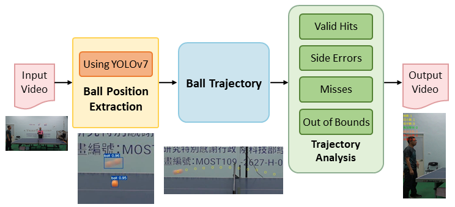 |
| :-----------------------------------------------------------------------------------: |
|                                     **Figure 1**                                      |

## Object Detection Model

In recent years, **deep learning** has been extensively applied in various computer vision tasks, including **image classification**, **object detection**, and **semantic segmentation**.
Among these, the **Convolutional Neural Network (CNN)** serves as a foundational architecture, integrating **feature extraction** and **classification** for efficient visual processing.

The feature extraction stage primarily consists of **convolutional layers** and **pooling layers**.
The convolutional layers use learnable **kernels** to perform operations over the input image with a defined **stride**, enabling the extraction of **high-level semantic features**.
Through multiple layers of convolution and pooling, the network produces a **feature map**, which is then passed to the classification head for final decision-making.

| 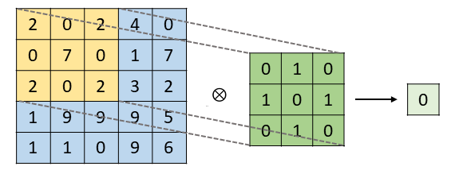 |
| :-----------------------------------------------------------------------------------: |
|            **Figure 2.** Illustration of convolutional operations in CNN.             |

To enhance model accuracy, deep learning models utilize a **loss function** to compute the error between predicted outputs and ground truth labels.
This error is minimized through **backpropagation**, which updates the **network weights** iteratively to improve both learning capacity and generalization performance.

In object detection tasks, CNNs are widely adopted for **localizing** and **classifying** objects.
In particular, **one-stage detection architectures** have gained attention due to their **efficiency** and **end-to-end learning capability**.
These models integrate feature extraction and object recognition into a **single unified framework**, enabling faster inference. Notable one-stage detectors include **Single Shot MultiBox Detector (SSD)** [2], **RetinaNet** [3], and the **You Only Look Once (YOLO)** family and its variants.
These models are known for their streamlined architecture and real-time performance, making them well-suited for time-sensitive applications.

Given the **fast motion** and **frequent direction changes** of the ball in table tennis, a detection model that balances speed and accuracy is essential.
**YOLOv7** achieves this balance effectively and demonstrates strong adaptability to **high-speed sports scenarios**, making it an ideal choice for our system.

| 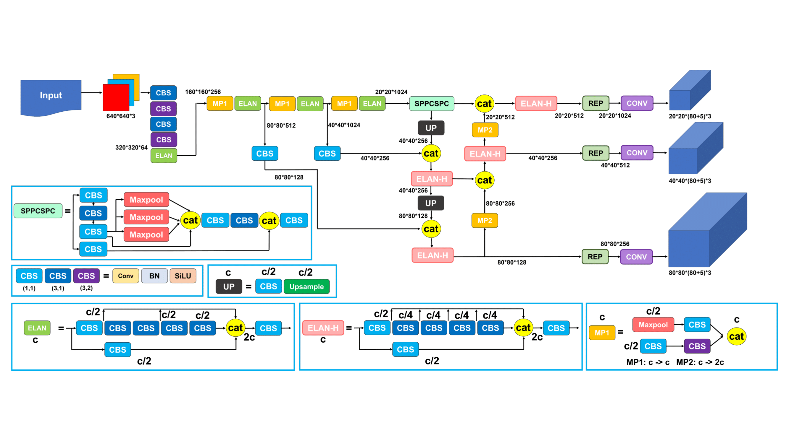 |
| :-----------------------------------------------------------------------------------: |
|           **Figure 3.** Architecture of the YOLOv7 object detection model.            |

### Activation Function

During the feature extraction stage in convolutional neural networks, each neuron generates an output by computing a **linear combination** of inputs from the previous layer.
While this linear mapping is computationally efficient, it limits the network’s ability to capture **nonlinear patterns** and **high-level semantic features**.

To address this limitation, **activation functions** are employed to introduce **nonlinear transformations**, enabling the network to learn more expressive and complex representations.
Common activation functions include the **Rectified Linear Unit (ReLU)** [4] and the **Leaky ReLU** [5].

The **ReLU** function is defined as:

$$
\text{ReLU}(x) = \max(0, x)
$$

| 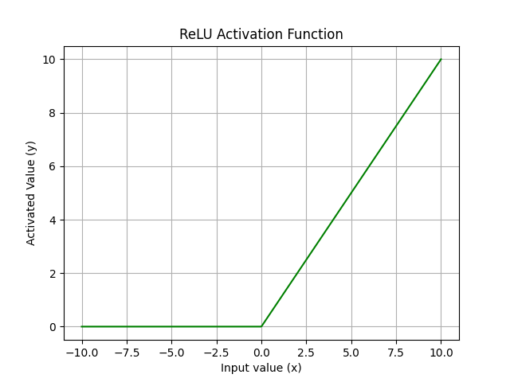 |
| :-----------------------------------------------------------------------------------: |
|               **Figure 4.** Operation of the ReLU activation function.                |

ReLU outputs the input directly if it is positive; otherwise, it outputs zero.
However, in the negative region, ReLU has a zero gradient, which may lead to the **"dead neuron" problem**, where neurons stop learning due to zero weight updates.

To overcome this issue, **Leaky ReLU** introduces a small slope $ \alpha $ in the negative region to retain a non-zero gradient:

$$
\text{Leaky ReLU}(x) = \max(\alpha x, x)
$$

| 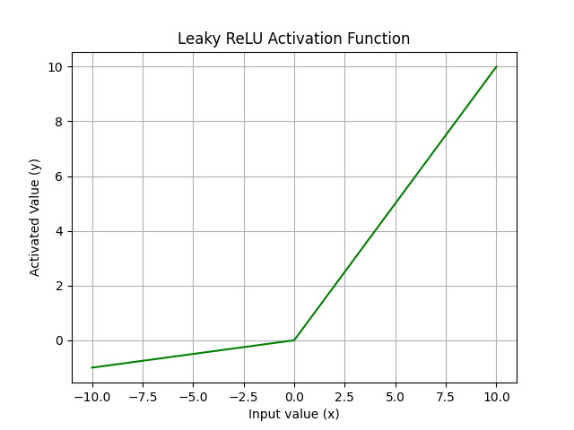 |
| :-----------------------------------------------------------------------------------: |
|            **Figure 5.** Operation of the Leaky ReLU activation function.             |

Although Leaky ReLU improves gradient flow, its nonlinear transformation remains relatively simple and may limit the ability to extract highly complex features.

To further enhance learning capability, **YOLOv7** adopts the **Sigmoid Linear Unit (SiLU)** [6] as its activation function. SiLU is defined as:

$$
\text{SiLU}(x) = x \cdot \text{sigmoid}(x) = \frac{x}{1 + e^{-x}}
$$

| 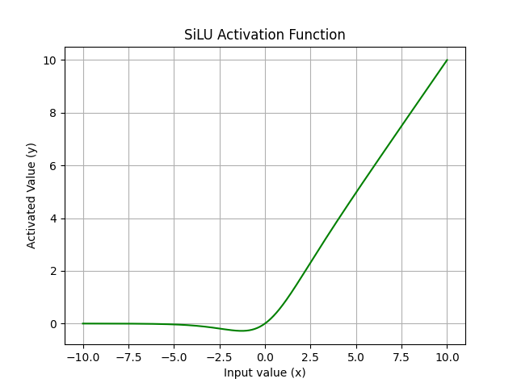 |
| :-----------------------------------------------------------------------------------: |
|               **Figure 6.** Operation of the SiLU activation function.                |

SiLU combines the input with its sigmoid activation, allowing the function to behave linearly for large positive inputs while smoothly approaching zero for negative inputs. Compared to ReLU and Leaky ReLU, SiLU offers a **smoother curve**, **continuous output**, and **better gradient stability**, which improves convergence during training and enhances the model’s ability to learn **complex visual features**.

### Bounding Box Loss Function

During the training of deep convolutional neural networks, the model learns to minimize a **loss function** in order to reduce prediction error and improve accuracy.
In **object detection tasks**, the **Intersection over Union (IoU)** metric is traditionally used to evaluate the overlap between the predicted and ground truth bounding boxes.
IoU is calculated as the ratio of the intersection area to the union area of the two boxes:

$$
\text{IoU} = \frac{\text{Area of Intersection}}{\text{Area of Union}} \tag{4}
$$

However, IoU only considers the **overlap ratio** and ignores other factors such as internal object structure or potential **hollow regions**, which may represent background areas inside the object boundary.
As a result, IoU may fail to provide a comprehensive assessment of detection accuracy, particularly in cases where internal inconsistencies affect localization.

To overcome these limitations, **Complete IoU (CIoU)** [7] was introduced as an enhanced bounding box regression metric.
CIoU incorporates additional geometric considerations such as the **distance between box centers**, **aspect ratio consistency**, and **object completeness**.
The CIoU loss is defined as:

$$
\text{CIoU} = 1 - \text{IoU} + \frac{\rho^2(\mathbf{b}^{\text{pred}}, \mathbf{b}^{\text{gt}})}{c^2} + \alpha \nu \tag{5}
$$

Where:

- $\mathbf{b}^{\text{gt}}$ and $\mathbf{b}^{\text{pred}}$ are the center points of the ground truth and predicted bounding boxes, respectively.
- $\rho$ represents the **Euclidean distance** between the two centers.
- $c$ is the **diagonal length** of the smallest enclosing box that covers both predicted and ground truth boxes.
- $\alpha$ is a weight function, and
- $\nu$ is the **aspect ratio similarity**, defined as:

$$
\nu = \frac{4}{\pi^2} \left( \arctan \frac{w^{\text{gt}}}{h^{\text{gt}}} - \arctan \frac{w^{\text{pred}}}{h^{\text{pred}}} \right)^2 \tag{6}
$$

Here, $w^{\text{gt}}, h^{\text{gt}}$ and $w^{\text{pred}}, h^{\text{pred}}$ refer to the **width and height** of the ground truth and predicted bounding boxes, respectively.

In this study, **CIoU is adopted as the bounding box loss function** to guide the object detection model.
By accounting for both spatial alignment and shape similarity, CIoU enables the model to learn more precise bounding box placements, significantly reducing localization errors and improving overall detection performance.

### Multi-Scale Feature Fusion Framework

The combination of the **Feature Pyramid Network (FPN)** and **Path Aggregation Network (PAN)** forms an efficient framework for **multi-scale feature extraction and fusion**, significantly enhancing YOLOv7’s capability to detect objects of various sizes and shapes.

Originally proposed by Lin et al. [8], the **FPN architecture** (see **Figure 7**) introduces a **top-down pathway** that progressively transmits high-level semantic features to lower-resolution feature maps.
This design compensates for the semantic deficiency of early-layer features and improves the model's ability to **detect small objects**.
By enabling feature flow across different layers, FPN allows multi-scale representations to be more semantically informative, thereby boosting detection accuracy across scales.

In contrast, the **PAN structure** introduces a **bottom-up pathway** that aggregates features from low to high levels.
This enhances object **localization** by enabling high-level features to incorporate **fine-grained spatial and structural details** from lower layers.
Conversely, low-level features are enriched with **semantic context** from upper layers.
The dual-directional flow ensures that feature maps at all levels are both **semantically meaningful** and **spatially detailed**.

Additionally, PAN incorporates **lateral connections** to strengthen inter-layer communication, leading to more effective feature fusion.
This architectural refinement enhances the network's robustness when detecting objects with **varied scales, aspect ratios, and complexities**.

| 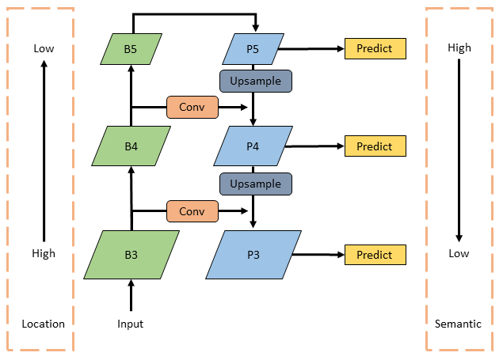 |
| :-----------------------------------------------------------------------------------: |
|           **Figure 7.** Architecture of the Feature Pyramid Network (FPN).            |

### SPPCSPC Network

The **SPPCSPC network** integrates the advantages of **Spatial Pyramid Pooling (SPP)** [9] and the **Cross Stage Partial Network (CSPNet)** [10] to enhance feature extraction capabilities and expand the **receptive field** of the model.

In the SPP module, input tensors are processed using **max pooling operations** with varying kernel sizes, all applied with a **stride of 1** to maintain the original spatial resolution.
By performing pooling at multiple scales, the module is able to capture **multi-level features** effectively.
These pooled feature maps are then concatenated with the original input to increase the model’s sensitivity to **objects of varying sizes**.

On the other hand, **CSPNet** improves computational efficiency by **splitting the input feature map into two parts**.
One part is passed through the SPP module to enhance the receptive field, while the other undergoes only a **single convolutional layer** to preserve critical feature information.
The two outputs are then **fused** and passed to the next stage of the network. This design not only leverages features from **different levels**, but also significantly reduces **parameter count** and improves **inference speed**.

The structure of SPPCSPC is illustrated in **Figure 8**, where each branch represents a distinct max pooling operation at a specific scale.
This architecture **expands the receptive field**, improves robustness, and enhances the network’s ability to detect **objects of diverse scales and shapes**.

| 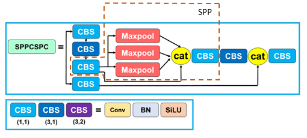 |
| :-----------------------------------------------------------------------------------: |
|                  **Figure 8.** Architecture of the SPPCSPC network.                   |

### Efficient Layer Aggregation Network

The **Efficient Layer Aggregation Network (ELAN)**, proposed by Wang et al. [11], serves as the **backbone** in object detection networks, designed for efficient and scalable feature extraction.

ELAN is built upon **gradient path design strategies**, aiming to address the issue of **slower convergence** that occurs as network depth increases.
By analyzing the **shortest and longest gradient paths** throughout the network, ELAN introduces an optimized **layer aggregation mechanism** to improve gradient flow, ensuring effective training and convergence even in **deep architectures**.

The ELAN design integrates advantages from both **VoVNet** [12] and **Cross Stage Partial Network (CSPNet)** [10].
In particular, the **cross-stage connections** from CSPNet are leveraged to enhance **feature fusion** and promote information sharing across layers.
This enables the network to make better use of **multi-level representations**, leading to **stronger feature expressiveness**, improved detection accuracy, and faster inference.

| 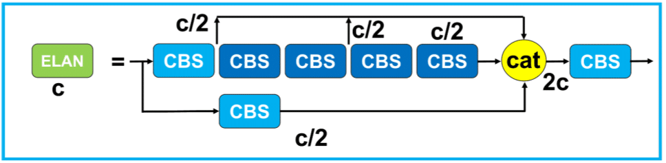 |
| :-----------------------------------------------------------------------------------: |
|     **Figure 9.** Architecture of the Efficient Layer Aggregation Network (ELAN).     |

## **Trajectory Management Mechanism**

To robustly track fast-moving table tennis balls across frames, this study introduces a **trajectory management mechanism** that performs dynamic ball-to-track association based on a weighted evaluation of multiple features.
The system computes a **matching score** between each detected bounding box and existing tracked objects to determine whether to update an existing trajectory or initialize a new one, as illustrated in **Figure 10**.

### **Feature Extraction and Similarity Scoring**

For each detection, the system calculates the following features in comparison to every existing tracked ball:

- **Intersection over Union (IoU)**: Measures the spatial overlap between the new detection and the existing ball’s predicted bounding box.
- **Direction Similarity**: Computed via cosine similarity between the estimated motion direction of the ball and the vector from the average center to the current detection.
- **Aspect Ratio Difference**: Quantifies the deviation in width-height ratio between the current and historical bounding boxes.
- **Weighted Distance**: Emphasizes vertical displacement more heavily than horizontal, given the motion characteristics in table tennis.

The **normalized scores** for each feature are defined as:

- **IoU score**:
$$
S_{\text{iou}} = \text{IoU}
$$
- **Direction score** (cosine similarity bounded in $[-1, 1]$):
$$
S_{\text{dir}} = \cos(\theta) = \frac{\vec{v}_{\text{avg}} \cdot \vec{v}_{\text{new}}}{\| \vec{v}_{\text{avg}} \| \cdot \| \vec{v}_{\text{new}} \|}
$$
- **Distance score** (normalized and reversed):
$$
S_{\text{dis}} = 1 - \min\left( \frac{d}{d_{\text{max}}}, 1 \right)
$$
- **Aspect Ratio score**:
$$
S_{\text{ar}} = 1 - \min\left( \frac{|\frac{w}{h} - \frac{w'}{h'}|}{\Delta_{\text{max}}}, 1 \right)
$$

### **Adaptive Weighting Mechanism**

To improve adaptability across scenes and object positions, this study introduces a **context-aware weighting strategy**.
The weights for each feature are computed dynamically based on:

- The **historical IoU** value
- The **horizontal position** of the ball in the frame (used as a proxy for motion context)

Let the weights be $w_{\text{iou}}$, $w_{\text{dir}}$, $w_{\text{dis}}$, and $w_{\text{ar}}$, the total score is calculated as:

$$
\text{Score} = w_{\text{iou}} \cdot S_{\text{iou}} + w_{\text{dir}} \cdot S_{\text{dir}} + w_{\text{dis}} \cdot S_{\text{dis}} + w_{\text{ar}} \cdot S_{\text{ar}}
$$

### **Assignment Decision**

Each detection is compared against all existing tracked balls.
Pairs are ranked by score and greedily assigned, ensuring each detection and trajectory is matched at most once.
If a score exceeds a predefined **association threshold**, the detection updates the matched trajectory; otherwise, a **new trajectory** is initialized.

### **Benefits**

This mechanism allows:

- **Robust multi-ball tracking** in scenes with multiple fast-moving objects
- **Adaptive scoring** based on real-time motion behavior and object location
- **Accurate trajectory continuity**, even under partial occlusion or irregular movement

|                 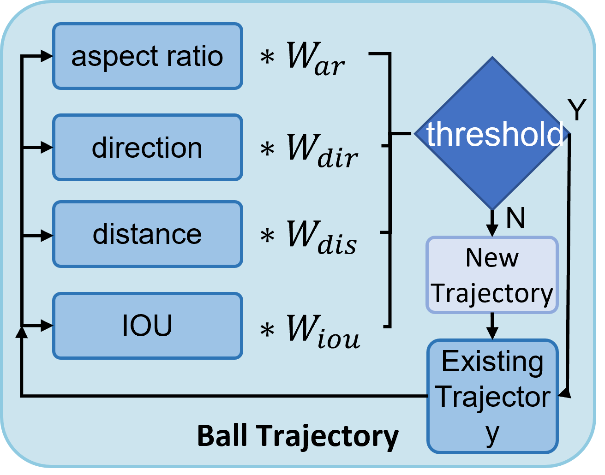                 |
| :---------------------------------------------------------------------------------------------------------------------: |
| **Figure 10.** Flowchart of the trajectory association mechanism based on multi-feature scoring and adaptive weighting. |

## Bounce Detection Method

In this study, bounce points are detected by leveraging the **parabolic nature** of the ball's motion trajectory.
A bounce is inferred when the ball **deviates from a previously fitted parabolic curve**, indicating contact with the table surface and the start of a new motion path.

This system specifically focuses on detecting the **first bounce point of a rightward-moving trajectory**, as the ball is consistently served from the right side.
Subsequent bounces are not considered in this analysis.

To determine if a bounce has occurred, the system compares the **vertical deviation** between the predicted trajectory and the actual observed ball position.
A bounce is registered if this deviation exceeds a predefined threshold.
To avoid false positives from paddle swings or noise, only detections with **consistent rightward motion** are evaluated.

The full algorithm, including [**parabolic equation fitting**](Table-Tennis-Trajectory-Landing-Point-and-Speed-Analysis-System#parabolic-equation-calculation) and [**bounce coordinate estimation**](Table-Tennis-Trajectory-Landing-Point-and-Speed-Analysis-System#bounce-coordinate-calculation), follows the approach detailed in a related work:
[**"Table Tennis Trajectory Landing Point and Speed Analysis System"**](Table-Tennis-Trajectory-Landing-Point-and-Speed-Analysis-System), which can be referenced for the complete mathematical formulation and detection logic.

## Experimental Results

In this study, we conducted experiments using video footage recorded in the **Smart Table Tennis Classroom at National Chung Hsing University**, capturing the launching process of an automatic ball-serving machine.
An overview of the experimental setup, including the camera position and ball-serving machine, is shown in **Figure 11**.
The resulting dataset covers a variety of ball trajectory scenarios. The proposed system, based on **YOLOv7** and the **trajectory management mechanism**, was evaluated for its adaptability to high-speed motion and its processing efficiency.

|          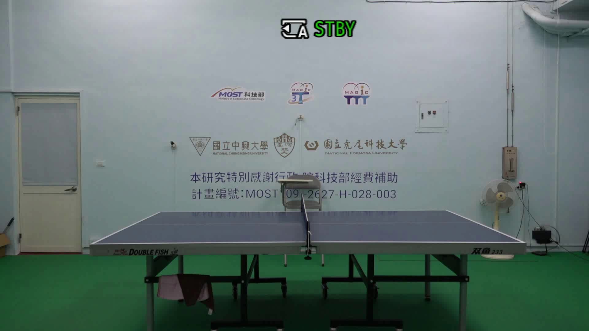          |
| :-------------------------------------------------------------------------------------------------------: |
| **Figure 11.** Experimental setup in the Smart Table Tennis Classroom at National Chung Hsing University. |

### Runtime Evaluation

To evaluate the system’s real-time performance, we measured the processing time required to analyze a test video.
As shown in **Table 1**, the system successfully completed trajectory tracking and bounce classification in approximately **one-third of the total video duration**, demonstrating excellent computational efficiency.

In the case of a 1-minute and 31-second input video, the YOLOv7 detection module achieved a rate of **58.1 frames per second (FPS)**, enabling reliable real-time ball localization.
These detections were then fed into the trajectory tracking module, which analyzed bounding box **aspect ratios**, **movement direction**, **distances**, and **IoU** across consecutive frames.
The system was able to accurately construct or update trajectories and identify bounce points as the ball deviated from its parabolic motion.

The full process took **39 seconds**, completing the tracking and classification of all detected trajectories, and demonstrating that the proposed method can handle high-speed sports scenarios with both **accuracy** and **efficiency**.

**Table 1. System processing time**

| Video Length | YOLO FPS | Ball Trajectory Tracking | Total Processing Time |
| :----------: | :------: | :----------------------: | :-------------------: |
| 1 min 31 sec | 58.1 FPS |          39 sec          |        39 sec         |

### Result Visualization

Through the integration of the trajectory management mechanism and bounce point detection, the system successfully identified landing positions and classified each shot as either a valid hit or an error.

When no new detections are added to a trajectory for six consecutive frames, the system determines that the trajectory has ended.
Based on the direction of motion at the final point, the system further classifies the outcome as either an out-of-bounds shot or a miss.
These cases are also demonstrated in the **video visualization**.

In addition to trajectory tracking and classification, a simple scoring mechanism was implemented to simulate a competitive match setting.
Each round consists of four serves, and if all four result in valid hits, the player earns one point; otherwise, the point is awarded to the ball-serving machine.
A total of seven rounds were conducted. The **final score is displayed at the top of the video**, while **shot classifications** appear in the **top-left corner**, providing immediate feedback and enhancing the system’s application value in smart table tennis training and match analysis.
