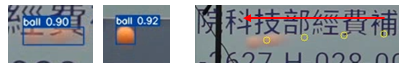
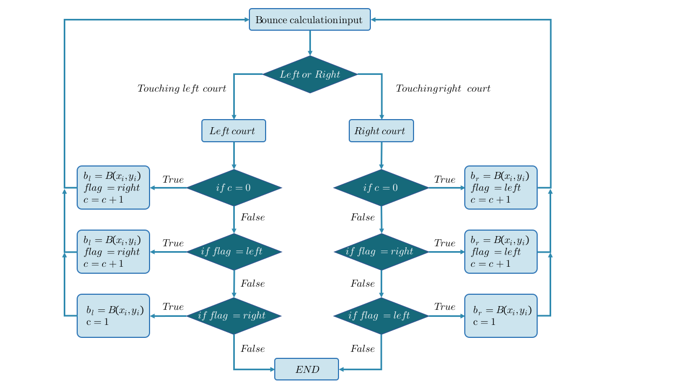
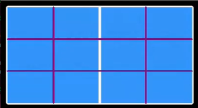
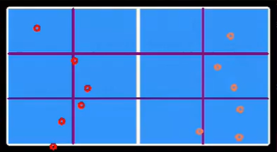
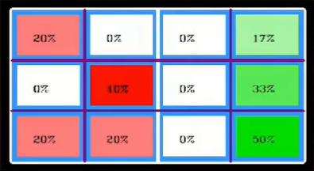
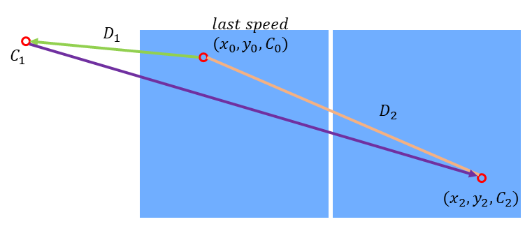
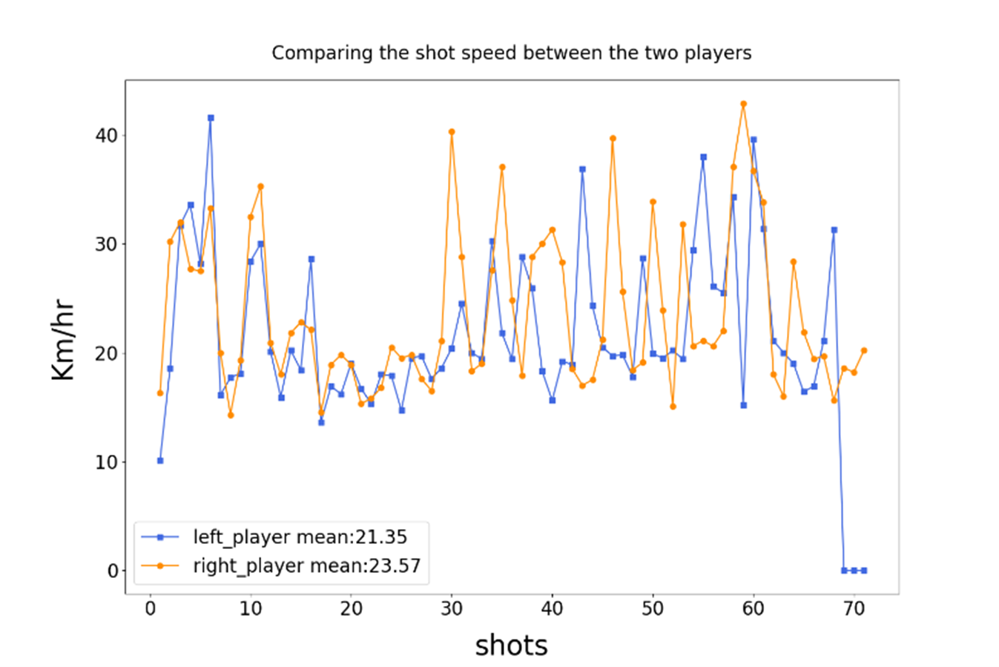
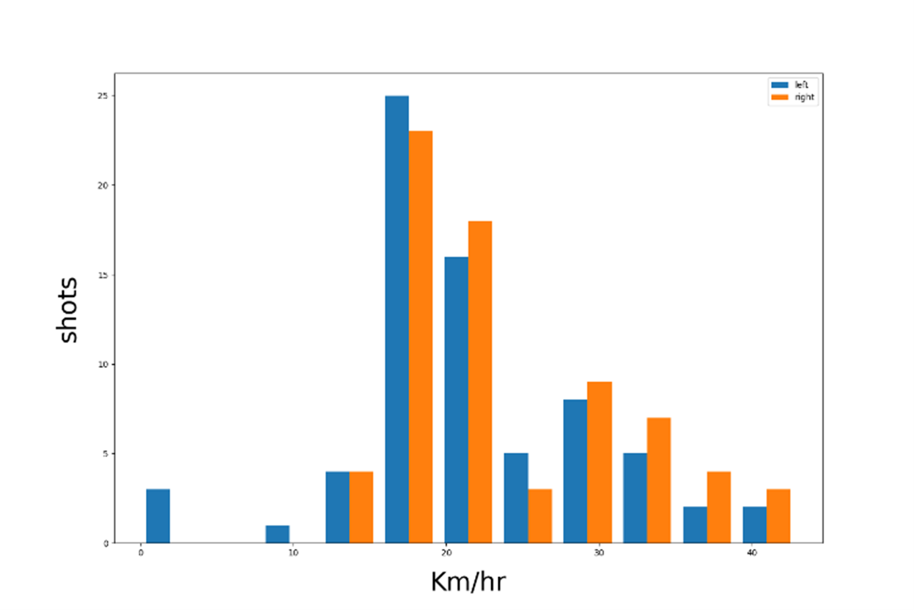

# Table Tennis Trajectory Landing Point and Speed Analysis System

---

## 2025 NIAG – Realtime Analysis & Broadcast (April 27)

**[The 2025 Hsinchu Intercollegiate Athletic Games (HIAG)](https://114niag.cjcu.edu.tw/)** table tennis events were held at the Tainan City Table Tennis Arena from April 25 to May 2.

**Ming Chuan University** was responsible for the live broadcast and teamed up with **National Chung Hsing University** to integrate real-time sports technology analysis.

This analysis system was capable of **fully analyzing an entire game**, providing not only real-time scores and stroke analyses but also in-depth insights into every rally, offering viewers a more detailed and accurate viewing experience.

---

## 2024 NIAG – Realtime Analysis & Broadcast (May 6)

**[The 2024 National Intercollegiate Athletic Games (NIAG)](https://113niag.ntus.edu.tw/)** table tennis events were held in Taichung from May 4 to 8.

**Ming Chuan University** was responsible for the live broadcast and partnered with **National Chung Hsing University** for the first time to integrate real-time sports data analysis, featuring segment-based data analysis.

This was the first time in Taiwan that data-driven insights were used in live broadcasts, providing a more engaging and scientifically-informed viewing experience for the audience.

_⭐ [【媒體報導】銘傳與中興攜手合作 首次運用 AI 運動科技進行賽事即時分析](https://www2.nchu.edu.tw/news-detail/id/57682)_

---

## Abstract

As smart sports continue to gain momentum, artificial intelligence has become an essential tool for analyzing athletic performance.
In ball-based sports, there is increasing interest in the development of automated systems capable of detecting and tracking ball trajectories.
By integrating machine learning with image processing techniques,
this study aims to enable automatic trajectory analysis and bounce point detection, thereby supporting tactical evaluation and enhancing situational awareness for coaches and athletes.

In this work, we employ YOLOv7 to detect and track the position of a table tennis ball in video sequences.
By connecting the detected center points across frames, we reconstruct the ball’s trajectory.
To identify bounce points, we apply parabolic motion analysis, allowing the system to determine contact events with the table surface.
Based on the extracted trajectory data, we further examine bounce locations, spatial distribution patterns, and ball velocity at various stages of motion.
This information can be utilized to support data-driven decision-making in coaching and skill development.

---

## Ball Detection and Tracking

In this study, we adopt **YOLOv7 (You Only Look Once version 7)**, a real-time object detection algorithm, to detect the position of the table tennis ball in each frame of the video sequence.
YOLOv7 processes each frame independently and identifies the ball by generating a **bounding box** around it with high confidence.

Once the ball is detected, the **center of the bounding box** is computed and used as the estimated **ball position** in that frame.
This approach offers a balance between detection precision and computational efficiency, particularly when dealing with high-speed objects such as a table tennis ball.

As the video progresses, YOLOv7 continuously detects the ball and outputs the center point of the bounding box in each frame.
By **connecting these center points sequentially**, we construct the **trajectory of the ball over time**.
This trajectory provides the basis for further analysis, including **bounce detection**, **speed estimation**, and **tactical visualization**.

This method allows for accurate tracking without relying on traditional tracking algorithms, as YOLOv7 is capable of maintaining detection stability across consecutive frames, even under conditions such as **motion blur** or **rapid direction changes**.
The resulting trajectory data serves as a foundational element for all subsequent computations and insights in this system.

---

## Bounce Detection Method

### Parabolic Equation Calculation

The trajectory of a table tennis ball during flight follows a **parabolic curve**. When the ball contacts and rebounds off the table surface, a **new parabolic trajectory** begins.
This study leverages this physical characteristic to estimate **bounce points** during the game.

We categorize bounce points into two types:

1. **The first bounce after a serve**, which typically occurs over a shorter trajectory.
2. **Subsequent bounces**, which generally involve longer parabolic motion.

Due to the shorter trajectory of the first bounce, we use **the previous 5 frames** for curve fitting. For later bounces, we use **the previous 8 frames** to fit a more extended parabola.

Let the quadratic function of the parabolic motion be defined as:

$$
P(x) = ax^2 + bx + c \tag{1}
$$

The continuous coordinates used for the fitting are:

$$
(x_{i-1}, y_{i-1}), (x_{i-2}, y_{i-2}), (x_{i-3}, y_{i-3}), \ldots, (x_{i-k}, y_{i-k}) \tag{2}
$$

Where $$ i $$ denotes the current frame index, and $$ k $$ is determined as:

$$
k =
\begin{cases}
5, & \text{if predicting the first bounce after a serve} \\
8, & \text{otherwise}
\end{cases} \tag{3}
$$

These points are then substituted into the parabolic equation to form the following system:

$$
\begin{aligned}
a{x_{i-1}}^2 + b x_{i-1} + c &= y_{i-1} \\
a{x_{i-2}}^2 + b x_{i-2} + c &= y_{i-2} \\
&\vdots \\
a{x_{i-k}}^2 + b x_{i-k} + c &= y_{i-k}
\end{aligned} \tag{4}
$$

We rewrite the above system in matrix form:

$$
A =
\begin{bmatrix}
x_{i-1}^2 & x_{i-1} & 1 \\
\vdots & \vdots & \vdots \\
x_{i-k}^2 & x_{i-k} & 1
\end{bmatrix}, \quad
\vec{b} =
\begin{bmatrix}
y_{i-1} \\
\vdots \\
y_{i-k}
\end{bmatrix}
\tag{5}
$$

Using the **least squares method**, we solve for the coefficient vector $$ X = [a\;\;b\;\;c]^T $$ with the following expression:

$$
X = (A^T A)^{-1} A^T \vec{b} \tag{6}
$$

### Bounce Coordinate Calculation

Using the **least squares method** described earlier, we obtain the general form of the **parabolic trajectory equation**.
To determine if a bounce event has occurred, we substitute a newly detected point into the fitted parabola.
If the calculated result deviates significantly from the expected value, we infer that a bounce has occurred.

Based on empirical observation, the table tennis ball appears to be approximately **12 pixels in diameter** in the video frames.
To define a threshold for detecting a bounce between two parabolic segments, we use the **ball’s radius** as a reference.
In this study, a **threshold of 5 pixels** is adopted to represent the maximum acceptable deviation from the predicted trajectory.

A bounce is detected when the vertical error between the predicted point and the actual observed point exceeds this threshold.
To reduce false positives caused by rapid racket movement during swings, we include a condition: only points with consistent horizontal motion direction between the current and previous frames are used for bounce prediction.

The predicted bounce coordinate $$ B(x_i, y_i) $$ is computed using the midpoint of the horizontal positions in the current and previous frames, substituted into the fitted parabola to get the vertical coordinate.

The bounce detection logic is defined as follows:

$$
B(x_i, y_i) =
\begin{cases}
\left( \dfrac{x_i + x_{i-1}}{2},\; P\left(\dfrac{x_i + x_{i-1}}{2}\right) \right), & \text{if } |P(x_i) - y_i| > h, \text{ Bounce} \\
\text{None}, & \text{otherwise, Not Bounce}
\end{cases} \tag{7}
$$

Where:

- $$P(x)$$ is the fitted parabolic function,
- $$h $$ is the error threshold (set to 5 pixels),
- $$x_i, y_i $$ are the coordinates of the detected ball center in the current frame,
- $$x_{i-1} $$ is the horizontal coordinate from the previous frame.

An example of bounce point prediction is shown below.

---

## Tactics Analysis Algorithm

### Perspective Transformation

To visualize tactical analysis results on a **2D virtual table surface**, it is necessary to first mark the **four corners of the actual table** in the video frame before performing any analysis.
These corner points define a trapezoidal region that, through transformation, is mapped back to the **real-world proportions** of a standard table tennis table.

The **standard dimensions** of a table tennis table are defined as a ratio of **274:152.5 (cm)**.
To achieve a proper geometric correction, we apply a **homogeneous coordinate transformation**, allowing us to convert coordinates from the distorted image plane to a rectified virtual plane.

Let **T** be the transformation matrix that maps a point $$(x, y)$$ in the video to its corresponding point $$(x', y')$$ on the virtual table. This transformation is described as follows:

$$
T =
\begin{bmatrix}
t_{11} & t_{12} & t_{13} \\
t_{21} & t_{22} & t_{23} \\
t_{31} & t_{32} & t_{33}
\end{bmatrix}, \quad
\begin{bmatrix}
x' \\
y' \\
1
\end{bmatrix}
=
T
\begin{bmatrix}
x \\
y \\
1
\end{bmatrix} \tag{8}
$$

Using the coordinates of the four corners in both the input image and the target plane (virtual table), we can solve for the transformation matrix $$T$$.
This enables all subsequent ball positions to be mapped accurately onto the virtual table for further tactical visualization and analysis.

### Valid Bounce Analysis Algorithm

Through **perspective transformation**, any point on the table surface can be mapped to a rectified virtual plane.
Using this mapping, the previously predicted **bounce point coordinates** are first transformed and validated.
If a point falls outside the boundaries of the transformed table area, it is classified as an **invalid bounce**.

According to the official rules of table tennis, the ball is only allowed to bounce once on each side of the table.
To enforce this rule in our system, we introduce the following elements:

- A **direction flag** (`flag`) indicating the current attacking direction
- Bounce coordinates on the **left** and **right** courts, denoted as $$b_l$$ and $$b_r$$
- A **bounce counter** `c` initialized to 0, which signifies the start of a service

The system checks each bounce to determine whether it occurs on the correct side of the table, based on the current value of `flag`.
If the bounce occurs in the expected direction (i.e., consistent with `flag`), it is considered **valid**.
Otherwise, it is marked as **invalid**.

Upon detection of valid bounces, the system connects the most recent left and right bounce coordinates to construct the **trajectory path** of the ball.
If **no bounce is detected for more than 2 seconds**, the system assumes the ball has **gone out of bounds**.

The complete decision-making process is illustrated below.

---

## Bounce Point Distribution

In table tennis matches, each bounce point corresponds to the **targeted area of attack** by the opponent.
To analyze these tactical patterns, we first divide the table surface into distinct zones.

The court is segmented both **longitudinally** and **laterally**:

- The **longitudinal direction** (along the length of the table) is divided into **front** and **back** zones.
- The **lateral direction** (across the width) is divided into **left**, **center**, and **right** zones.

Next, using the previously detected **bounce points**, we map each point onto the **flattened analytical view** of the table surface.

We then count the number of bounce events within each zone and apply **min-max normalization** to the data. This allows for consistent and comparable visualization using a **color gradient**, where **darker shades** represent zones with higher bounce frequency.

The normalization formula is defined as:

$$
X_{nom} = \frac{X - X_{min}}{X_{max} - X_{min}} \tag{9}
$$

Where:

- $$ X $$ is the raw bounce count in a given zone,
- $$ X*{min} $$ and $$ X*{max} $$ represent the minimum and maximum bounce counts across all zones,
- $$ X\_{nom} $$ is the normalized value used for color mapping.

The resulting **heatmap** provides an intuitive visualization of the **spatial distribution** of bounce points and highlights players’ favored attack regions.

---

## Ball Speed Calculation

By connecting the predicted bounce points on the virtual table, we can estimate the **distance the ball travels** from the moment it is struck to when it reaches the opponent’s side.
In addition, we analyze the **frame difference** in the video sequence corresponding to the change in the ball’s horizontal position.
By combining these two pieces of information, we can estimate the **ball speed**.

Since a monocular camera setup does not provide depth information outside the table,
this study approximates the travel distance by multiplying the ball's previous speed by the elapsed time (frame difference) between the bounce point and the hitting moment.
This approximation is defined as:

$$
D_1 = \text{last speed} \times \left( \frac{100000}{3600} \right) \times (C_1 - C_0) \times F \tag{10}
$$

Where:

- $$ D_1 $$ is the estimated external distance (in centimeters),
- $$ C_1 $$ is the current frame index where horizontal movement is observed,
- $$ C_0 $$ is the frame index at which the bounce occurs,
- $$ F $$ is the frame time (i.e., time per frame in seconds).

Next, we compute the **Euclidean distance** between two consecutive bounce points on the virtual table using:

$$
D_2 = \sqrt{(x_2 - x_0)^2 + (y_2 - y_0)^2} \tag{11}
$$

Where:

- $$ (x_0, y_0) $$ and $$ (x_2, y_2) $$ are the coordinates of two consecutive bounce points on the virtual table.

We then apply a **scaling factor** `cvt` to convert the virtual distance to real-world size, based on the actual table dimensions.

The final ball speed (in km/h) is computed as:

$$
\text{speed} = \frac{D_1 + (D_2 \times cvt)}{(C_2 - C_1)} \times F \times \left( \frac{3600}{100000} \right) \tag{12}
$$

This formula combines both the predicted travel distance and the time interval to derive the final velocity of the ball.
A schematic diagram of this process is shown below.

### Speed Distribution and Visualization

In the next stage of our analysis, we visualize the **ball speed of each player** throughout the rally.
For both the left and right players, we record the ball speed for each individual stroke, and plot the results as a **line chart** to observe how the speed fluctuates across time.

By analyzing these speed trends, we can compare the **playing styles** and **attack intensity** of both players.
For instance, a player with frequent high-speed strokes may exhibit a more aggressive playing style, while another may show a more defensive approach with slower but more consistent speeds.

After plotting the per-stroke speed data, we further present the **overall distribution** of ball speeds for each player.
This visualization provides a more intuitive understanding of each player’s performance and strategic tendencies throughout the match.

The resulting visualizations, as shown in the figure below, help highlight the differences in stroke power and speed consistency between the two players.

|                                         **line chart**                                          |                                              **overall distribution**                                               |
| :---------------------------------------------------------------------------------------------: | :-----------------------------------------------------------------------------------------------------------------: |
|  |  |
